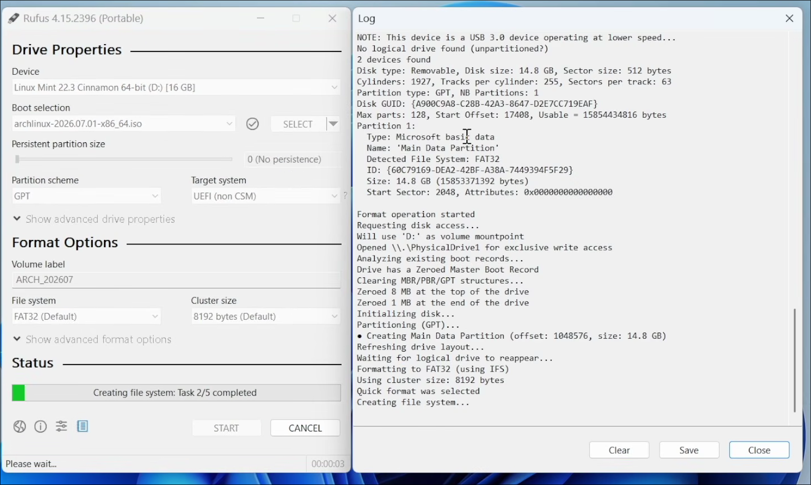
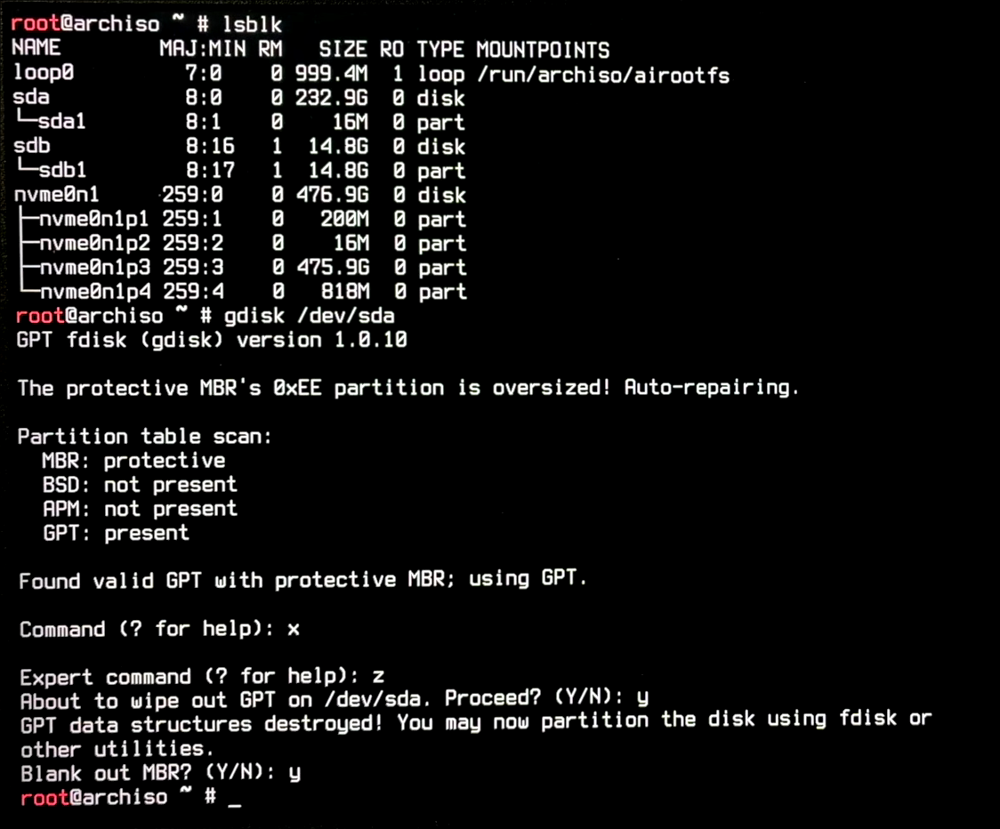

<div align="center">

# Arch Linux for Humans

### A clean, no-nonsense walkthrough from USB stick to a fully working desktop.

**Written for humans. Not for people who memorize wikis at 3 AM.**

---

</div>

## Table of Contents
- [Before You Begin](#before-you-begin)
- [Step 1 — BIOS / UEFI Setup](#step-1--bios--uefi-setup)
- [Step 2 — Booting the Installer](#step-2--booting-the-installer)
- [Step 3 — Pre-Installation Checks](#step-3--pre-installation-checks)
  - [3.1 Set a Readable Font](#31-set-a-readable-font)
  - [3.2 Verify Internet Connection](#32-verify-internet-connection)
  - [3.3 Connect to Wi-Fi (If Needed)](#33-connect-to-wi-fi-if-needed)
  - [3.4 Wipe the Target Drive](#34-wipe-the-target-drive)
  - [3.5 Sync Packages and Keyring](#35-sync-packages-and-keyring)
- [Step 4 — Running archinstall](#step-4--running-archinstall)
  - [4.1 Language](#41-language)
  - [4.2 Locales](#42-locales)
  - [4.3 Mirrors](#43-mirrors)
  - [4.4 Disk Configuration](#44-disk-configuration)
  - [4.5 Swap](#45-swap)
  - [4.6 Bootloader](#46-bootloader)
  - [4.7 Kernels](#47-kernels)
  - [4.8 Hostname](#48-hostname)
  - [4.9 Authentication](#49-authentication)
  - [4.10 Profile](#410-profile)
  - [4.11 Applications](#411-applications)
  - [4.12 Network Configuration](#412-network-configuration)
  - [4.13 Additional Packages](#413-additional-packages)
  - [4.14 Timezone](#414-timezone)
  - [4.15 NTP (Time Sync)](#415-ntp-time-sync)
  - [4.16 Install](#416-install)
- [Step 5 — Reboot](#step-5--reboot)
- [Step 6 — Post-Installation](#step-6--post-installation)
- [Troubleshooting](#troubleshooting)
- [Resources](#resources)

---

## Before You Begin

Here is everything you need before touching a single command.

| Item | Details |
|------|-------|
| **USB Drive** | Minimum 8 GB. Everything on it will be erased. |
| **Arch Linux ISO** | Download the latest from [archlinux.org/download](https://archlinux.org/download/) |
| **Rufus** | Windows tool to flash the ISO onto your USB. Get it from [rufus.ie](https://rufus.ie) |
| **Internet** | Ethernet cable (recommended) or a Wi-Fi network with the password ready. |
| **Backup** | If the target drive has data you care about, back it up now. There is no undo. |

> [!WARNING]
> Flashing the ISO with Rufus will **completely wipe** your USB drive. Double-check you selected the correct drive before clicking Start.

Open Rufus, select your USB drive, choose the downloaded Arch ISO, and click **Start**. Leave all other settings at their defaults.



---

## Step 1 — BIOS / UEFI Setup

Before booting from the USB, you need to adjust a few BIOS settings. Restart your machine and press the BIOS key (usually `F2`, `F12`, `DEL`, or `ESC` depending on your motherboard).

Make the following changes:

| Setting | Value |
|---------|-------|
| USB Boot | **Enabled** |
| Secure Boot | **Disabled** |
| Fast Boot | **Disabled** |
| Boot Order | USB drive **first** |

Save and exit the BIOS.


---

## Step 2 — Booting the Installer

After saving your BIOS settings, the machine will reboot. You should see the Arch Linux boot menu.

Select the first option:

```
Arch Linux install medium (x86_64, UEFI)
```

Wait for the system to load. You will eventually land on a root shell prompt that looks like this:

```
root@archiso ~ #
```

You are now running Arch Linux entirely from the USB stick. Nothing has been installed yet.

---

## Step 3 — Pre-Installation Checks

### 3.1 Set a Readable Font

The default terminal font is tiny. Fix that immediately:

```bash
setfont ter-132n
```

This is temporary and only affects the current session. Your eyes will thank you.

---

### 3.2 Verify Internet Connection

If you plugged in an Ethernet cable, you are likely already connected. Verify with:

```bash
ping -c 5 google.com
```

If you see replies, you are good. Skip to [3.4](#34-wipe-the-target-drive).

If you get nothing back, you need to connect to Wi-Fi manually.

---

### 3.3 Connect to Wi-Fi (If Needed)

Arch's live environment uses `iwctl` for wireless management. Launch it:

```bash
iwctl
```

You will now be inside the `[iwd]#` prompt. Follow these steps in order:

**List your wireless devices:**

```
device list
```

You should see `wlan0`. If it shows as powered off, enable it:

```
device wlan0 set-property Powered on
```

**Scan for available networks:**

```
station wlan0 get-networks
```

Your network name (SSID) should appear in the list. Connect to it:

```
station wlan0 connect YOUR_NETWORK_NAME
```

> [!NOTE]
> You will be prompted for a passphrase. **The characters will not appear on screen as you type.** This is normal. Type the password carefully, wait a few seconds, and press `Enter`.

Once connected, exit iwctl:

```
exit
```

Verify the connection:

```bash
ping -c 5 google.com
```

Replies mean you are connected. Move on.

---

### 3.4 Wipe the Target Drive


> [!Note]
> If you are using the default partition layout in Step 4.4, you can skip this step as the installer will format the drive for you.


> [!WARNING]
> This step **permanently erases all data** on the selected drive. There is no recovery. Make absolutely sure you are targeting the correct disk.

First, list all connected drives to identify the correct one:

```bash
lsblk
```

You will see output similar to this:

```
NAME   MAJ:MIN RM   SIZE RO TYPE MOUNTPOINTS
sda      8:0    0 465.8G  0 disk
sdb      8:16   1  14.9G  0 disk
```

In this example, `sda` is the 465 GB internal drive (the target), and `sdb` is the 14.9 GB USB stick. **Do not wipe the USB.**

Once you have identified the correct drive, launch `gdisk`:

```bash
gdisk /dev/sda
```

Inside gdisk, perform the following:

1. Type `x` and press `Enter` to enter **expert mode**.
2. Type `z` and press `Enter` to **wipe the drive**.
3. Confirm with `Y` when prompted.
4. Confirm again with `Y` to erase the MBR.



The drive is now completely clean.

---

### 3.5 Sync Packages and Keyring

Before running the installer, make sure the package database and signing keys are up to date:

```bash
pacman -Sy
```

```bash
pacman -S archlinux-keyring
```

The Arch ISO ships with `archinstall` pre-installed, but if for any reason it is missing:

```bash
pacman -S archinstall
```

---

## Step 4 — Running archinstall

This is where the real installation begins. Launch the guided installer:

```bash
archinstall
```

You will see an interactive menu. Navigate with the **arrow keys**, select with **Enter**, and go back with **Escape**.

Walk through each option below in order.

---

### 4.1 Language

This sets the language of the installer itself, not your system.

Select **English** (or your preferred language) and press `Enter`.

---

### 4.2 Locales

This defines your keyboard layout and system language.

| Option | Recommended Value |
|--------|-------------------|
| Keyboard layout | `us` (or your country code, e.g., `de`, `fr`, `es`) |
| System language | `en_US.UTF-8` (or your locale, e.g., `es_CL.UTF-8`) |

> [!TIP]
> Always choose a **UTF-8** locale. It ensures proper character encoding across all applications.

Leave the encoding option at its default. Select **Back** when done.

---

### 4.3 Mirrors

This determines which servers your packages download from. Choosing a mirror close to you makes downloads significantly faster.

1. Select **Mirror region**.
2. Find your country in the list.
3. Press `Space` to select it.
4. Press `Enter` to confirm.

Select **Back** to return.

---

### 4.4 Disk Configuration

This is the most critical step. Pay attention.

1. Select **Disk configuration**.
2. Choose **Use a default partition layout**.
3. You will see a list of available drives. Select the drive you wiped earlier.

> [!WARNING]
> Selecting the wrong drive here will destroy its data. Cross-reference with the `lsblk` output from earlier. The drive size should match.

4. Press `Space` to select the drive, then `Enter`.
5. Choose your filesystem:

| Filesystem | When to Use |
|------------|-------------|
| **ext4** | Reliable, well-supported, great default choice. Recommended for most users. |
| **btrfs** | Snapshots, compression, advanced features. Better for experienced users. |

6. When asked **"Would you like to create a separate partition for /home?"**, select **Yes**.

> [!TIP]
> A separate `/home` partition keeps your personal files (documents, configs, downloads) safe even if you reinstall or switch distributions later. This is highly recommended.

7. Skip LVM and encryption for a first-time installation unless you specifically need full-disk encryption.

Select **Back** to return.

---

### 4.5 Swap

Swap is a portion of your drive used as virtual memory when your RAM fills up. It prevents system crashes during heavy memory usage.

Leave swap **enabled** (it is on by default). No changes needed.

---

### 4.6 Bootloader

The bootloader is the program that starts your operating system when you power on the machine.

Select **GRUB**.

GRUB is the most widely used and compatible bootloader for Linux. Unless you have a specific reason to use `systemd-boot` or `rEFInd`, GRUB is the safe choice.

---

### 4.7 Kernels

The kernel is the core of your operating system. archinstall includes the standard `linux` kernel by default.

Add **linux-lts** as well.

| Kernel | Purpose |
|--------|---------|
| `linux` | Latest features, most recent hardware support. |
| `linux-lts` | Long-Term Support. More stable, receives security patches for years. |

Having both means if an update to the latest kernel breaks something, you can still boot into the LTS kernel from the GRUB menu.

---

### 4.8 Hostname

This is the name your machine identifies itself with on a network.

The default is `archlinux`. You can keep it or change it to something personal:

```
my-machine
```

Use lowercase letters and hyphens only. No spaces.

---

### 4.9 Authentication

This section sets up your passwords and user account.

**Root password:**

1. Select **Root password**.
2. Enter a strong password.
3. Confirm it.

> [!WARNING]
> Do not leave the root password blank. Leaving it blank disables the root account entirely and forces you to rely solely on `sudo`, which can lock you out of your system if something goes wrong.

**User account:**

1. Select **User account**.
2. Choose **Add a user**.
3. Enter a username (lowercase, no spaces).
4. Enter and confirm a password.
5. When asked **"Should this user be a superuser (sudo)?"**, select **Yes**.
6. Select **Confirm and exit**.

This user will be your daily login. The `sudo` privilege lets you run administrative commands without logging in as root.

---

### 4.10 Profile

This is where you choose your desktop environment.

1. Select **Profile**.
2. Choose **Desktop**.
3. Select your desktop environment:

| Desktop Environment | Character |
|---------------------|-----------|
| **KDE Plasma** | Feature-rich, highly customizable, modern. |
| **GNOME** | Clean, minimal, workflow-focused. |
| **XFCE** | Lightweight, fast, traditional layout. Great for older hardware. |
| **Cinnamon** | Familiar, Windows-like layout. Easy transition. |
| **i3 / Sway** | Tiling window managers. Keyboard-driven. For power users. |

4. Press `Enter` to confirm your selection.

**Graphics drivers:**

| Option | When to Use |
|--------|-------------|
| **All open-source** | Default. Works for Intel, AMD, and most setups. |
| **Nvidia (proprietary)** | Select this only if you have an Nvidia GPU. |
| **VMware / VirtualBox** | Select if installing inside a virtual machine. |

**Login manager (Greeter):**

Leave at the default (usually `lightdm` or `sddm` depending on your desktop choice). Select **Back**.

---

### 4.11 Applications

Configure optional system services.

| Option | Recommendation |
|--------|----------------|
| **Bluetooth** | Enable if your machine has Bluetooth hardware. |
| **Audio** | Select **Pipewire**. It is the modern standard and replaces both PulseAudio and JACK. |

---

### 4.12 Network Configuration

Select **Use NetworkManager**.

NetworkManager provides automatic network management for both wired and wireless connections. It integrates with your desktop environment's system tray for easy Wi-Fi switching.

---

### 4.13 Additional Packages

You can type package names here to install them during setup, separated by spaces.

This is optional. You can install anything later with `pacman`. If you want a head start, consider:

```
git vim firefox
```

Or leave it blank and press `Enter`.

---

### 4.14 Timezone

Select your region, then your city.

Example: `America/New_York`, `Europe/London`.

This ensures your system clock is accurate.

---

### 4.15 NTP (Time Sync)

Leave this **enabled**.

NTP (Network Time Protocol) automatically keeps your system clock synchronized with internet time servers. There is no reason to disable it.

---

### 4.16 Install

You have configured everything. The menu will now show a summary of your choices.

1. Select **Install**.
2. You will be asked: **"Would you like to chroot into the newly created system?"** Select **No**.
3. Confirm with **Yes** to begin the installation.

The installer will now:

- Partition and format your drive
- Download and install the base system
- Install your chosen desktop environment
- Configure the bootloader, network, and user accounts

This will take several minutes depending on your internet speed and hardware.

When you see green text confirming the installation is complete, you are done.

---

## Step 5 — Reboot

Select **Exit archinstall** from the final menu.

Shut down the machine:

```bash
shutdown now
```

> [!IMPORTANT]
> **Remove the USB drive** before powering the machine back on. If you do not, it will boot back into the installer instead of your new system.

Power on. You should see the GRUB menu, followed by your login screen. Enter your username and password.

Welcome to Arch Linux.

---

## Step 6 — Post-Installation

You are logged into a fresh desktop. Here are the first things you should do.

**Verify your internet connection:**

```bash
ping -c 5 google.com
```

**Update the entire system:**

```bash
sudo pacman -Syu
```

You will be prompted for your user password (the one you created during installation). This pulls in any updates released since the ISO was built.

**Install fastfetch to verify your setup:**

```bash
sudo pacman -S fastfetch
```

```bash
fastfetch
```

This displays a clean summary of your system: kernel version, desktop environment, CPU, GPU, memory, and more. A quick visual confirmation that everything installed correctly.

**Enable the firewall (recommended):**

```bash
sudo pacman -S ufw
sudo ufw enable
sudo systemctl enable ufw
```

**Install an AUR helper (optional but useful):**

The Arch User Repository (AUR) contains community-maintained packages not found in the official repos. `yay` is the most popular AUR helper:

```bash
sudo pacman -S --needed git base-devel
git clone https://aur.archlinux.org/yay.git
cd yay
makepkg -si
```

After this, you can install AUR packages with `yay -S package-name`.

---

## Troubleshooting

| Problem | Solution |
|---------|----------|
| `archinstall` command not found | Run `pacman -S archinstall` first. |
| Wi-Fi not showing in `iwctl` | Run `device wlan0 set-property Powered on`, then re-scan. |
| Ping returns nothing after Wi-Fi connect | Re-check the passphrase. Remember characters are invisible while typing. |
| Wrong drive wiped in gdisk | Always verify with `lsblk` first. Match the drive size to your hardware. |
| System boots to USB after install | Remove the USB drive before powering on. Check BIOS boot order. |
| Black screen after reboot | At the GRUB menu, select the `linux-lts` kernel instead. |
| No audio after install | Run `sudo pacman -S pipewire pipewire-pulse wireplumber` and reboot. |

---

## Resources

- [Arch Wiki — Installation Guide](https://wiki.archlinux.org/title/Installation_guide)
- [Arch Wiki — archinstall](https://wiki.archlinux.org/title/Archinstall)
- [Arch Wiki — General Recommendations](https://wiki.archlinux.org/title/General_recommendations)
- [Arch Linux Download Page](https://archlinux.org/download/)

---
